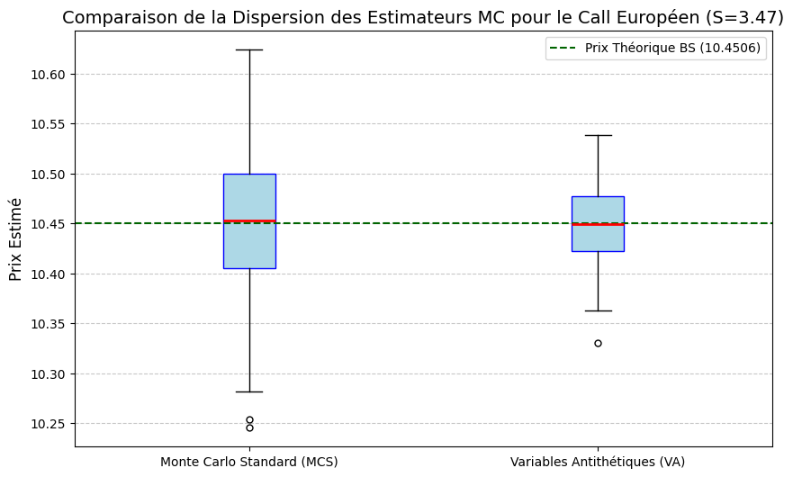
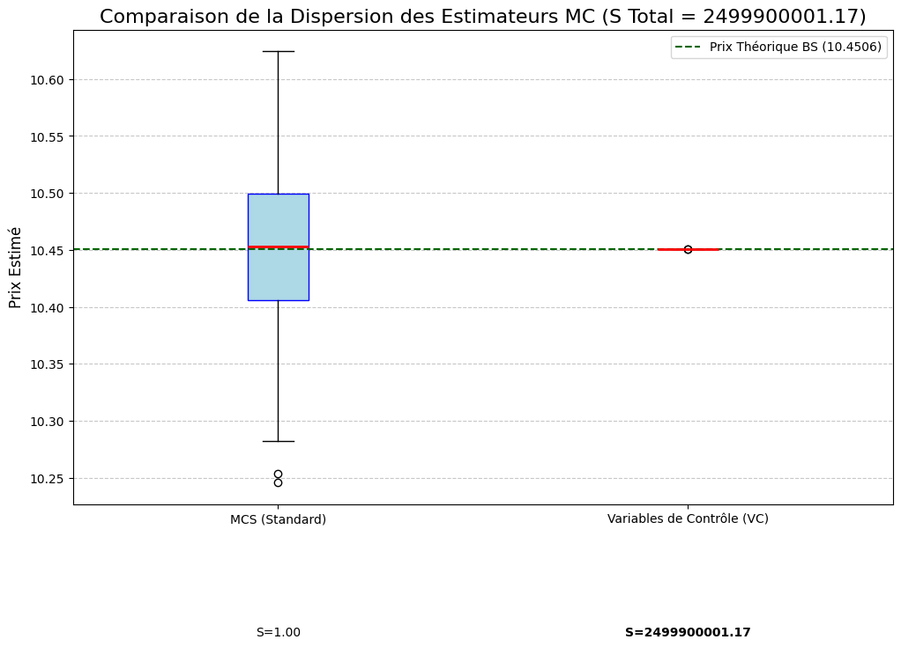
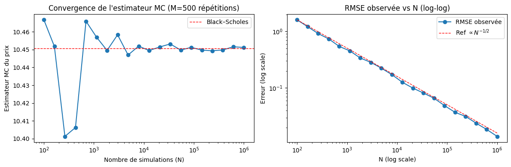

# 📈 Analyse de la Convergence et Optimisation de la Simulation Monte-Carlo

## 🔍 Présentation Générale

Ce projet étudie et implémente des **Techniques de Réduction de Variance (TRV)** appliquées à l’évaluation d’options **Call Européennes** dans le cadre du modèle de **Black–Scholes–Merton**.

L’objectif est double :

- **Analyser rigoureusement la convergence** de l’estimateur Monte-Carlo standard (MCS)
- **Quantifier l’amélioration de précision et de coût de calcul** apportée par des techniques industrielles de réduction de variance

Le projet vise à illustrer comment des méthodes Monte-Carlo, a priori coûteuses et bruitées, peuvent atteindre une **précision quasi-analytique**, tout en conservant la flexibilité requise pour la valorisation de produits complexes.

> 📌 **Contexte académique et quantitatif** : ce travail s’inscrit dans une démarche M1/M2 orientée finance quantitative, méthodes numériques et modélisation stochastique.

---

## 🎯 Résultats Clés — Facteurs d’Accélération

L’efficacité des différentes techniques est mesurée à l’aide du **Facteur d’Accélération** :

$$
\mathcal{S}=\frac{\mathrm{Var}(\hat{C}_{\text{MCS}})}
     {\mathrm{Var}(\hat{C}_{\text{TRV}})}
$$

Ce facteur représente le **gain équivalent en temps de calcul** pour atteindre une même précision statistique. Plus il est grand, plus le temps de calcul diminue.

| Technique |  Facteur d’Accélération $\mathcal{S}$ | Interprétation |
|---|---|---|
| **Variables Antithétiques (VA)** |  **3.47** | Gain immédiat, simple, sans surcoût algorithmique |
| **Variables de Contrôle (VC)** |  **$2,5 \times 10^9 $** | Technique de référence en pratique industrielle |

**Preuve Visuelle de la Performance (VA vs MCS)**

**Preuve Visuelle de la Performance (VC vs MCS)**

> **Conclusion principale** : la combinaison systématique des méthodes (VA puis VC) permet d’obtenir une **convergence rapide**, stable et économiquement exploitable.

---

## ⚙️ Paramètres du Modèle

Les simulations sont réalisées sur un **Call Européen At-The-Money** :

| Paramètre | Symbole | Valeur |
|---|---|---|
| Prix initial | $S_0$ | 100 |
| Strike | $K$ | 100 |
| Taux sans risque | $r$ | 5 % |
| Volatilité | $\sigma$ | 20 % |
| Maturité | $T$ | 1 an |

**Prix analytique de référence (Black–Scholes)** :

$$
{C}_{\text{BS}} = 10.4506
$$

---

## 🧪 Méthodologie Numérique

Le graphique ci-dessous valide l'adhérence de l'estimateur Monte-Carlo à la vitesse de convergence théorique $\mathcal{O}(N^{-1/2})$ du RMSE, un prérequis essentiel à toute optimisation.

La démarche expérimentale suit les étapes suivantes :

1. Simulation de trajectoires du sous-jacent via un **Mouvement Brownien Géométrique**
2. Estimation Monte-Carlo standard du payoff
3. Validation de la convergence via le **Théorème Central Limite**
4. Application successive des techniques :
   - Variables Antithétiques
   - Variables de Contrôle
5. Comparaison des variances empiriques et calcul des facteurs d’accélération

Toutes les estimations sont réalisées à nombre de trajectoires comparable.

---

## 📁 Organisation du Projet

├── src/
│   ├── simuler_modele.py
│   ├── estimateur_montecarlo.py
│   ├── variables_antithetiques.py
│   ├── control_variate.py
│   ├── analyse_convergence_erreur.py
│   └── test_couverture_IC.py
│
├── notebooks/
│   ├── validation_montecarlo.ipynb
│   ├── optimisation_variables_antithetiques.ipynb
│   └── optimisation_variable_controle.ipynb
│
├── requirements.txt
└── README.md

### 📁 Modules Python (`src/`)

| Module | Rôle | Fonctions principales |
|------|------|----------------------|
| `simuler_modele.py` | Simulation du sous-jacent (GBM) | `simuler_ST` |
| `estimateur_montecarlo.py` | Estimateur Monte-Carlo standard | `prix_montecarlo_call`, `vrai_prix_call` |
| `variables_antithetiques.py` | Réduction de variance – variables antithétiques | `price_mc_antithetic_call` |
| `control_variate.py` | Réduction de variance – variables de contrôle | `prix_mc_control_variate_call` |
| `analyse_convergence_erreur.py` | Analyse de la convergence et de l’erreur | `plot_convergence_RMSE` |
| `test_couverture_IC.py` | Tests de couverture des IC (TCL) | `plot_couverture_IC` |

---

### 🛠️ Dépendances

Les bibliothèques Python suivantes sont nécessaires à l’exécution du projet :

numpy
scipy
pandas
matplotlib
seaborn
jupyterlab
tqdm
joblib

Les versions exactes utilisées sont précisées dans le fichier `requirements.txt`.

### Installation

pip install -r requirements.txt

jupyter lab

### Notebooks à Exécuter (par ordre recommandé)

L’analyse est conduite à l’aide de notebooks Jupyter.
Après lancement de JupyterLab, exécuter les notebooks dans l’ordre recommandé.

1. **Validation de l’estimateur Monte-Carlo standard**  
   📄 `validation_montecarlo.ipynb`  
   → Étude de la convergence de l’estimateur, illustration du Théorème Central Limite (TCL) et analyse de la distribution du sous-jacent \(S_T\).

2. **Optimisation par Variables Antithétiques (VA)**  
   📄 `optimisation_variables_antithetiques.ipynb`  
   → Implémentation du couplage antithétique \((Z, -Z)\), comparaison des variances et calcul du facteur d’accélération associé.

3. **Optimisation par Variables de Contrôle (VC)**  
   📄 `optimisation_variable_controle.ipynb`  
   → Estimation du coefficient optimal de contrôle, analyse de la réduction de variance et synthèse comparative finale.

## 👤 Auteur

Guy Ange GROGUHE
Finance quantitative · Méthodes Monte-Carlo · Modélisation stochastique

## ⚖️ Licence

Ce projet est distribué sous licence MIT.
